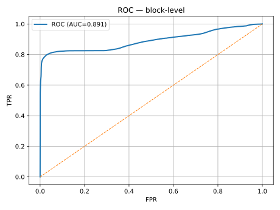

# Model Card — HDFS Log Anomaly Detection

## Overview
Clasificador supervisado de anomalías a nivel **bloque** usando texto de logs con `HashingVectorizer` + `SGDClassifier` (logistic), **calibración Platt** y **agregación por bloque**.

## Intended Use
- Detección temprana de incidentes en pipelines Hadoop/HDFS.
- Priorización de alertas con umbrales operativos (por tasa de positivos o precisión mínima).

## Data
- Dataset: HDFS (public).
- Etiquetas por **block_id**; preprocesado convierte a `message`, `block_id`, `label`.

## Metrics (block-level)
- AUC-PR: **0.7548**, ROC-AUC: **0.8906**, F1: **0.7466** (posrate=3%, agg=max).
- Prevalencia ≈ 2.93%.

## Evaluation Procedure
- Split estable por `block_id` (hash % K).
- Entrenamiento en streaming (chunks), validación por bloque, calibración Platt en hold-out.
- Agregación por bloque (`max`, `mean` o `noisy_or`).

## Ethical Considerations
- Riesgo de **falsos positivos** que generen ruido operativo; mitigar con `min_precision`.
- Riesgo de **falsos negativos**; mitigar con `posrate`/recall alto en fases tempranas.

## Limitations
- Solo texto crudo; no usa plantillas ni lógica de dominio.
- Validado en HDFS; generalización a otros logs requiere ajuste de preprocesado.

## Contact
Alexis Martínez
alexis.martinez.6584@gmail.com
