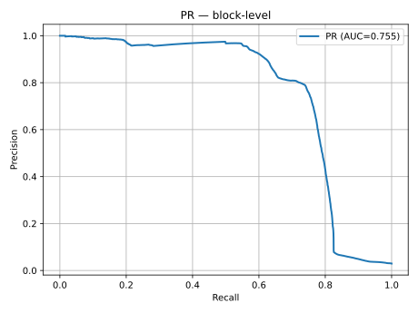
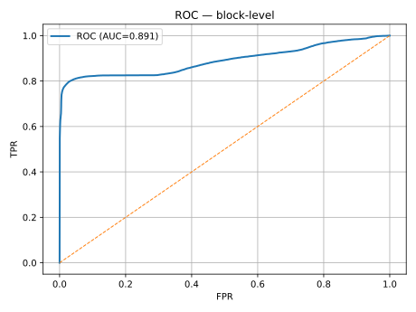
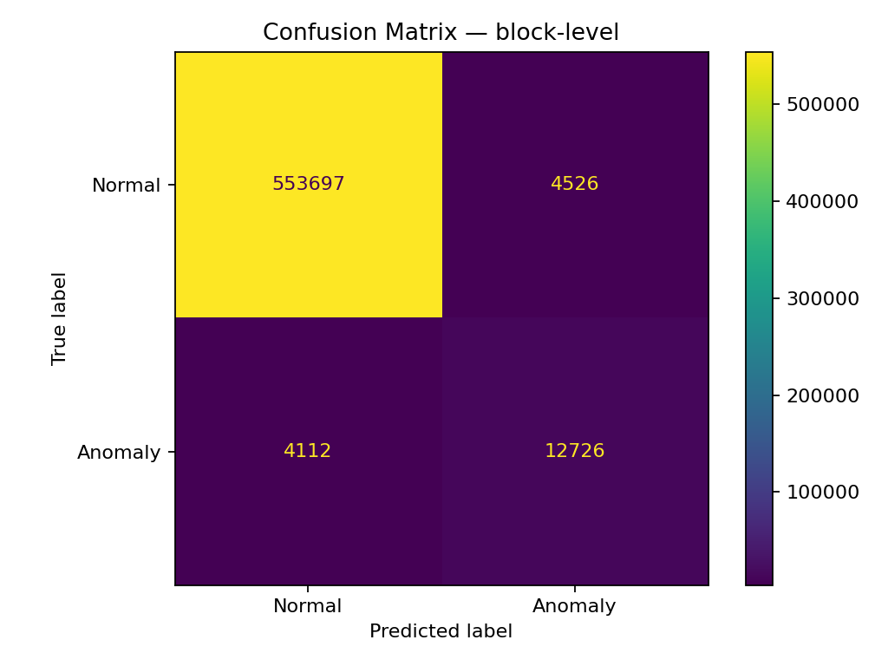

# HDFS Log Anomaly Detection — Fast, Reproducible, CPU-Friendly

[English](README.en.md) · [Español](README.md)

[](https://github.com/alex-msu/anomaly-log-detector/actions/workflows/ci.yml)
[](LICENSE)
[](https://colab.research.google.com/github/alex-msu/anomaly-log-detector/blob/main/notebooks/hdfs_anomaly_detection.ipynb)

Block-level anomaly detection on **HDFS** logs using a **HashingVectorizer + SGD (streaming)** pipeline, **Platt calibration**, **block aggregation** (`max`, `mean`, `noisy_or`), and **operational thresholding** (`posrate` or `min_precision`).  
Runs **on CPU** (<13 GB RAM). An optional **Autoencoder baseline** is included for comparison.

## Results (HDFS, block-level)

| Model | n_features | Aggregation | Threshold | AUC-PR | ROC-AUC | Precision (1) | Recall (1) | F1 (1) |
|---|---:|---|---|---:|---:|---:|---:|---:|
| Hashing + SGD (this repo) | 2^18 | **max** | **posrate=3%** | **0.7548** | **0.8906** | 0.7377 | 0.7558 | **0.7466** |
| Autoencoder (line-level baseline) | — | — | p99 | ~0.067 | ~0.57 | ~0.17 | ~0.05 | ~0.07 |

> Prevalence in this split ≈ **2.93%**. All metrics are **block-level**.

**Curves (block-level):**  
  
  


## Quickstart

```bash
python -m venv .venv && source .venv/bin/activate
pip install -r requirements.txt

export HDFS_MODE=sgd
export HDFS_AGG=max
export HDFS_THRESHOLD_MODE=posrate
export HDFS_TARGET_POSRATE=0.03
export HDFS_MIN_PREC=0.25
export HDFS_CHUNKSIZE=200000
export HDFS_NFEATURES=262144
export HDFS_NGRAM=1,2

python main.py
````

See [README.md](README.md) for full documentation (how it works, reproducibility/CI, extending to other datasets, limitations, license, and citation).

