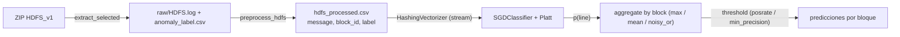

# Detección de Anomalías en HDFS — Rápido, Reproducible y Amigable con CPU

[Español](README.md) · [English](README.en.md)

[](https://github.com/alex-msu/anomaly-log-detector/actions/workflows/ci.yml)
[](LICENSE)
[](https://colab.research.google.com/github/alex-msu/anomaly-log-detector/blob/main/notebooks/anomaly_detection.ipynb)

Este proyecto implementa un pipeline **simple y eficiente** para **detectar anomalías a nivel de bloque** en el dataset de logs **HDFS**, usando:

- **HashingVectorizer + SGDClassifier (logistic)** en **streaming** (sin vocabulario; memoria estable).
- **Calibración Platt** (mejora la calidad de probabilidades).
- **Agregación por bloque** (`max`, `mean` o `noisy_or`) para pasar de línea → bloque.
- **Selección de umbral operativa**: por tasa de positivos (`posrate`) o precisión mínima (`min_precision`).

Funciona **en CPU** con <13 GB de RAM (ej. Google Colab estándar). Incluye un **baseline Autoencoder (opcional)** sólo para comparación.

---

## Resultados (HDFS, evaluación a nivel de **bloque**)

| Modelo | n_features | Agregación | Umbral | AUC-PR | ROC-AUC | Prec. (clase 1) | Recall (clase 1) | F1 (clase 1) |
|---|---:|---|---|---:|---:|---:|---:|---:|
| Hashing + SGD (este repo) | 2^18 | **max** | **posrate=3%** | **0.7548** | **0.8906** | 0.7377 | 0.7558 | **0.7466** |
| Autoencoder (baseline por línea) | — | — | p99 | ~0.067 | ~0.57 | ~0.17 | ~0.05 | ~0.07 |

> La prevalencia en el split mostrado es ≈ **2.93%**. Todas las métricas están calculadas a nivel de **bloque** (no por línea).

**Curvas (nivel bloque):**  
  
  


---

## ¿Por qué nivel de BLOQUE y no por línea?

En HDFS, las etiquetas son por **block_id** (sesión). Evaluar por línea introduce sesgos (muchos FN y distribución de scores poco informativa). Este repo:

1. Entrena por línea (texto) → prob. de anomalía por línea.  
2. **Agrega por bloque** (`max`, `mean` o `noisy_or`) para obtener un **score por bloque**.  
3. Selecciona un **umbral operativo** según tu criterio (cobertura vs. ruido).

---

## Quickstart (CPU-friendly)

```bash
# 1) Entorno
python -m venv .venv && source .venv/bin/activate   # (Windows: .venv\Scripts\activate)
pip install -r requirements.txt

# 2) Ejecutar de punta a punta en HDFS (modo rápido CPU)
export HDFS_MODE=sgd
export HDFS_AGG=max                           # max | mean | noisy_or
export HDFS_THRESHOLD_MODE=posrate            # posrate | min_precision | f1 | fixed
export HDFS_TARGET_POSRATE=0.03               # ≈ prevalencia
export HDFS_MIN_PREC=0.25
export HDFS_CHUNKSIZE=200000
export HDFS_NFEATURES=262144                  # 2**18; prueba 2**19 si tienes RAM
export HDFS_NGRAM=1,2

python main.py
````

### Demo en Colab

Haz clic en el *badge* de arriba. El notebook configura las variables de entorno y ejecuta `main.py` en modo `sgd` (**Run all**).

---

## Cómo funciona (pipeline)



**Puntos clave**

* **HashingVectorizer** evita construir vocabulario → memoria estable y entrenamiento por *chunks*.
* **SGDClassifier (log\_loss)** con ponderación progresiva de clases.
* **Platt** (logistic sobre `logit(p)`) calibra probabilidades.
* **Agregación por bloque**:

  * `max` (recomendado) recupera bloques con una línea muy informativa.
  * `mean` estabiliza cuando hay ruido homogéneo.
  * `noisy_or` es conservador si `p(line)` tiende a ser baja.

**Operación (umbral)**

* `posrate`: fija la tasa de positivos (ej. 3%) → mayor **recall** controlando el volumen de alertas.
* `min_precision`: exige precisión mínima (ej. ≥0.4/0.5) → menos **ruido**.
* `f1`: útil para comparar, no siempre óptimo en producción.

---

## Reproducibilidad, Hardware y CI

* Split de validación **determinista por bloque** (hash % K).
* Entrenamiento **streaming** por *chunks* → no carga todo en RAM.
* Corre **en CPU** (<13 GB RAM); **sin GPU** es suficiente.
* **CI (GitHub Actions)**: *smoke test* con subset pequeño (descargar → extraer → preprocesar → entrenar → evaluar).

---

## Estructura del repositorio

```
.
├── src/
│   ├── sgd_hashing_pipeline.py     # entrenamiento + evaluación (bloque) + calibración
│   ├── hdfs_download.py            # descarga/extracción (selectiva)
│   ├── hdfs_preprocess.py          # limpieza + merge etiquetas → CSV procesado
│   ├── pytorch_*                   # (baseline AE opcional)
├── notebooks/
│   └── anomaly_detection.ipynb     # demo (Colab)
├── docs/assets/                    # PR/ROC/CM (generadas desde artefactos)
├── models/                         # se genera
├── data/                           # se genera (gitignored)
├── scripts/
│   └── hdfs_smoke_test.py          # CI rápido con subset
├── main.py
├── requirements.txt
├── MODEL_CARD.md
├── CITATION.cff
├── LICENSE
└── .github/workflows/ci.yml
```

---

## Generar imágenes (PR/ROC/CM) **sin re-entrenar**

Si ya corriste la evaluación y tienes:

* `data/results/sgd_hash.block_probs.joblib`
* `data/results/sgd_hash.metrics.joblib`

puedes reconstruir las curvas **sin repetir el proceso**. En el notebook (o local), ejecuta la celda que reconstruye `y_true` desde el CSV procesado y guarda las figuras en `docs/assets/`. *(Este repo incluye la celda en el notebook y/o `scripts/plot_block_curves.py`)*.

> Si usaste un **subset** (ej. para CI), apunta `HDFS_PROCESSED_CSV` al mismo CSV para alinear `y_true` con `probs`.

---

## Extender a otros datasets de logs

Mientras puedas producir `message, block_id, label`, puedes reutilizar el pipeline:

1. Adapta `hdfs_preprocess.py` a tu formato de logs.
2. Comienza con: `HDFS_AGG=max`, `HDFS_THRESHOLD_MODE=posrate`, `HDFS_TARGET_POSRATE≈prevalencia`.
3. Ajusta `HDFS_NFEATURES` (2^18 → 2^19/2^20) y `HDFS_NGRAM` (1,2).
4. (Siguiente paso) Considera **Drain + conteos por bloque** (features ligeras) si necesitas aún más precisión/recall.

---

## Limitaciones y hoja de ruta

* Actualmente usa **texto crudo**; no incorpora parsing a **plantillas** (Drain) ni features de bloque (conteos/ratios).
* Validación mostrada en un fold (`val_pick`); recomendamos validar en varios folds para reportes formales.

**Próximos hitos**

* Parser de plantillas (Drain) + features de bloque → Logistic/LightGBM.
* Ensamble simple (score texto + features bloque).
* Scripts de comparación con AE optimizado (baseline).

---

## Licencia, Citación y Créditos

* Licencia: **Apache 2.0** (ver `LICENSE`).
* Para citar: ver `CITATION.cff`.
* Autoría y contacto: **Alexis Martínez** — alexis.martinez.6584@gmail.com
* Agradecimientos: dataset público de HDFS.

---

## Preguntas frecuentes

**¿Puedo operar con alta precisión?**
Sí. Usa `HDFS_THRESHOLD_MODE=min_precision` y define `HDFS_MIN_PREC` (ej. 0.50). El recall bajará, pero reducirás falsos positivos.

**¿Y si quiero más recall?**
Sube `HDFS_TARGET_POSRATE` (ej. 3.5–5%) o cambia a `agg=mean` si tu dominio lo permite.

**¿Necesito GPU?**
No para el pipeline principal. La GPU sólo es útil si comparas con el baseline AE.